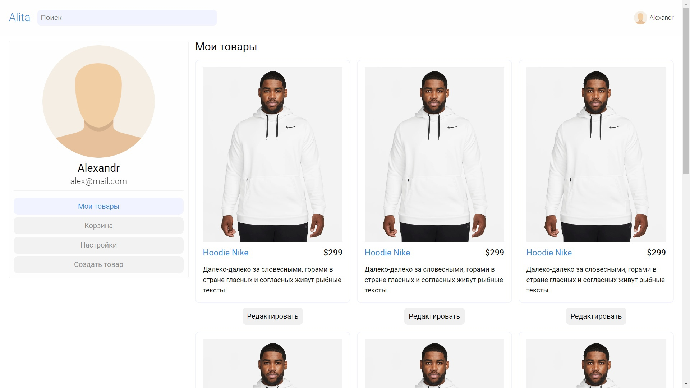
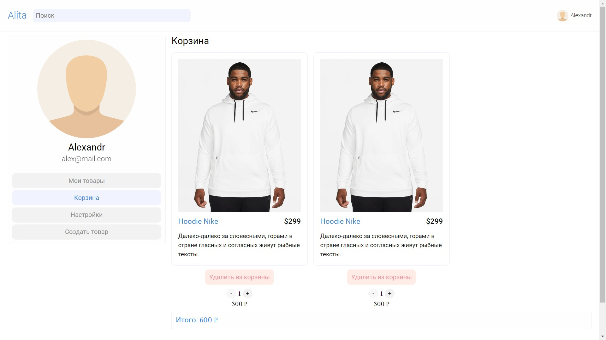
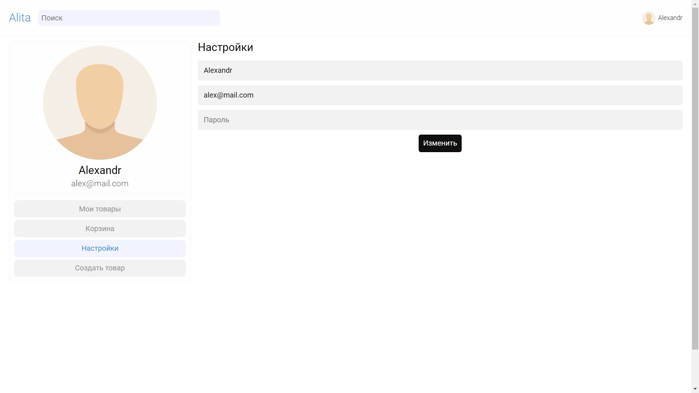

# Alita

This is an online store where you can buy and sell items of different categories. This project is written on the PEVN stack

## Options

### Home page


### My products page



### Cart page



### Settings page



### Create product page


### Edit product page


## Build Setup

```bash
# install dependencies
$ npm install

# serve with hot reload at localhost:3000
$ npm run dev

# build for production and launch server
$ npm run build
$ npm run start

# generate static project
$ npm run generate
```
